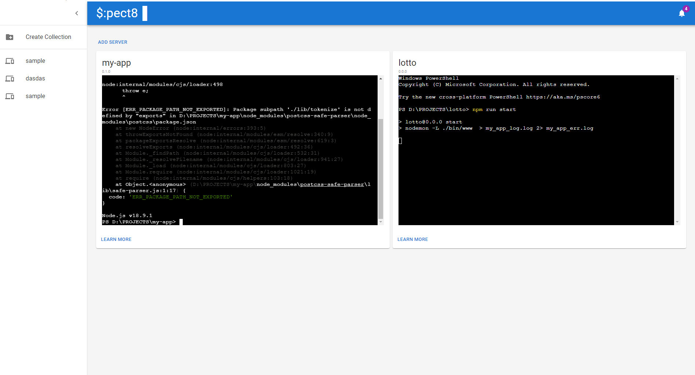

# $pec8r|

$pc8r| is an open source node.js server development management tool that will help you run multiple node instance. Monitor your instance as easy as viewing them on a single page.

## Future update:

The ability to manage, monitor and diagnose server development before it goes live or pass for QA testing.

- [x] Management per project
- [ ] Profiling
- [ ] Diagnostic
